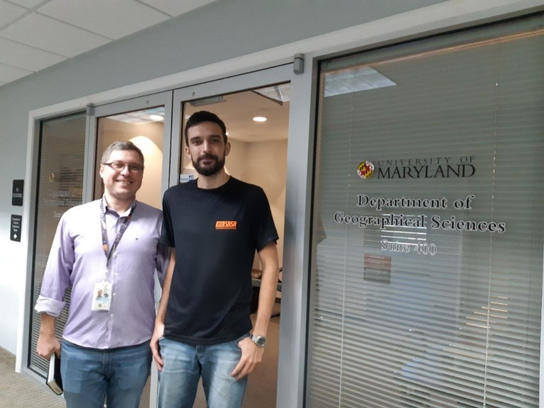

SENSING - Satellites for ENvironmental Solutions Informing Nations Globally - Internship Fellowship awarded

---

 <a href="http://www.obt.inpe.br/OBT/noticias-obt-inpe/doutorando-victor-prudente-da-pgser-foi-contemplado-pelo-print-inpe">Pt-Br(orginal source)</a> 

Victor Hugo Rohden Prudente, a doctoral student in the Remote Sensing program at INPE (PG-SER), supervised by Ieda Del'Arco Sanches and Marcos Adami, was awarded a doctoral sandwich scholarship by PrInt/INPE, within the subproject "Use of satellites for environmental solutions informing nations globally (SENSING - Satellites for ENvironmental Solutions Informing Nations Globally)". Victor began the sandwich program in October and will have twelve months to develop the project "Multisensor optical-SAR approach to land use and land cover characterization in Roraima" at the Department of Geographical Science, University of Maryland, in College Park, Maryland, United States of America, under the supervision of Sergii Skakun.

---

